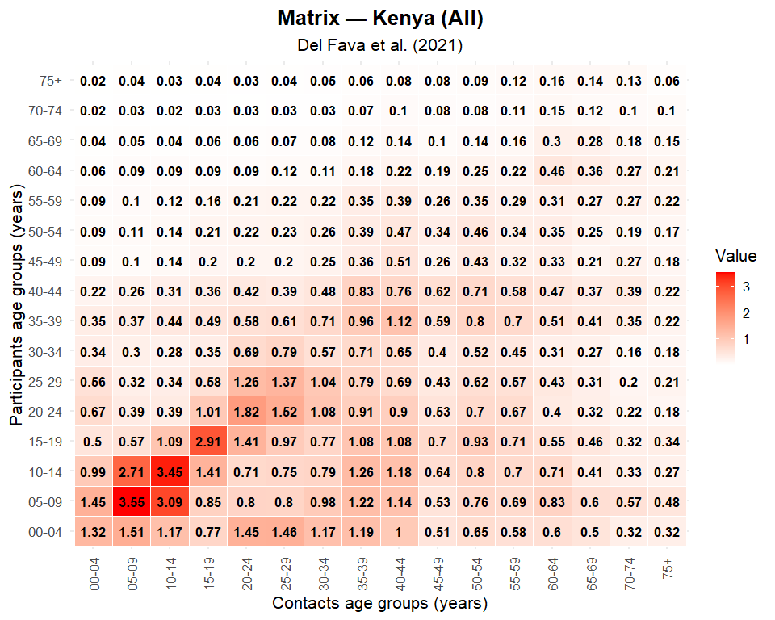
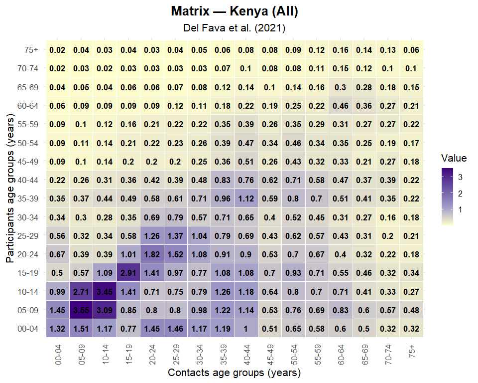
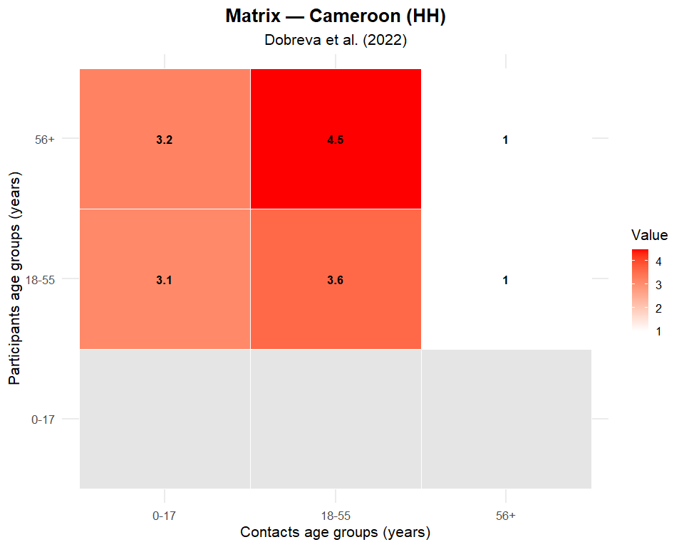
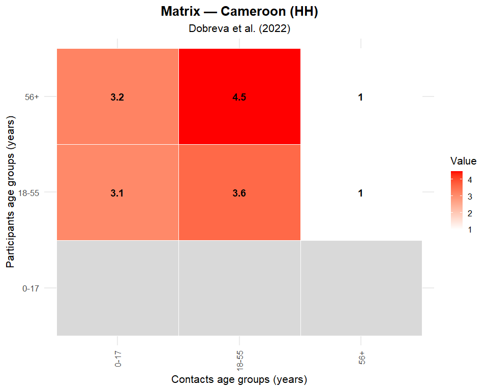

# **Social Contact Matrices for Sub‑Saharan Africa**

[](https://doi.org/10.5281/zenodo.19174136)

`ssamixr` provides harmonized, ready‑to‑use **social contact matrices**
from empirical studies conducted across Sub‑Saharan Africa.  
The package includes **171 matrices** covering multiple countries,
settings, and study designs — all standardized for infectious disease
modeling and comparative epidemiology.

------------------------------------------------------------------------

# 🚀 Installation

``` r
# Install pak if needed
if (!requireNamespace("pak", quietly = TRUE)) {
  install.packages("pak")
}

# Install ssamixr package
pak::pak("fbkengne/ssamixr")

# Load the package
library(ssamixr)
```

🧭 Getting Started: A Simple Workflow  
Most users will want to:

1.  List all available matrices  
2.  Filter matrices by country, study, or location  
3.  Select a matrix ID  
4.  Retrieve the matrix  
5.  Visualize it

1️⃣ List all matrices

``` r
all_mats <- list_matrices()
head(all_mats)
#> # A tibble: 6 × 7
#>   matrix_id study_id            author_year country location_type row_age_groups
#>       <dbl> <chr>               <chr>       <chr>   <chr>         <chr>         
#> 1       201 Cameroon_Dobreva_2… Dobreva et… Camero… HH            0-17;18-55;56+
#> 2       202 Cameroon_Dobreva_2… Dobreva et… Camero… School;Work   0-17;18-55;56+
#> 3       203 Cameroon_Dobreva_2… Dobreva et… Camero… Other         0-17;18-55;56+
#> 4       204 Cameroon_Dobreva_2… Dobreva et… Camero… All           0-17;18-55;56+
#> 5       205 Cameroon_Dobreva_2… Dobreva et… Camero… All           0-17;18-55;56+
#> 6       206 DR_Congo_Dobreva_2… Dobreva et… Democr… HH            0-17;18-55;56+
#> # ℹ 1 more variable: col_age_groups <chr>
```

2️⃣ Filter matrices  
Example: matrices from Kenya

``` r
kenya <- filter_matrices(country = "Kenya")
```

Example: household (HH) matrices

``` r
hh <- filter_matrices(location_type = "HH")
```

Example: combine filters

``` r
kenya_hh <- filter_matrices(country = "Kenya", location_type = "HH")
```

3️⃣ Select a matrix ID

``` r
id <- kenya$matrix_id[1]
```

4️⃣ Retrieve the matrix

``` r
m <- get_matrix(id)
```

5️⃣ Visualize the matrix Default heatmap

``` r
plot_matrix(m)
```

<!-- -->

Gradient palette

``` r
plot_matrix_gradient(m)
```

<!-- -->

🔧 Visualization Parameters  
Both plot_matrix() and plot_matrix_gradient() support flexible,
publication‑ready visualization of social contact matrices.

Automatic label rotation  
By default:

If the matrix has more than 10 age groups, column labels rotate
vertically

Otherwise, they remain horizontal

You can override this behavior:

``` r
cameroon <- filter_matrices(country = "Cameroon")
id <- cameroon$matrix_id[1]
m <- get_matrix(id)
plot_matrix(m, col_label_orientation = "normal")
```

<!-- -->

📐 Full Parameter Reference  
Parameter Default Description Options  
m — A matrix returned by get_matrix().  
blank_color, default = “grey90”, Fill color for missing values,
options(Any color).  
low_color (plot_matrix only), default = “white”, Low end of gradient,
options(Any color).  
high_color (plot_matrix only), default = “red”, High end of gradient,
options(Any color).  
value_text, default = TRUE, Print numeric values inside cells,
options(TRUE, FALSE).  
size, default = 4.5 Text size for cell values, options(Any positive
number).  
col_label_orientation, default = “auto”, Orientation of column labels,
options(“auto”, “normal”, “vertical”).  
base_size, default = 16, Base font size for the plot, options(Any
positive number0.

🎨 Gradient Version  
plot_matrix_gradient() uses a fixed 4‑color palette:

``` r
c("#FFFFCC", "#9E9AC8", "#6A51A3", "#3F007D")
#> [1] "#FFFFCC" "#9E9AC8" "#6A51A3" "#3F007D"
```

Everything else works the same as plot_matrix().

🧪 Example with custom options

``` r
plot_matrix(
  m,
  size = 5,
  col_label_orientation = "vertical",
  blank_color = "grey85"
)
```

<!-- -->

📊 Dataset Summary  
The package contains:

- 171 social contact matrices

- covering 18 Sub‑Saharan African countries

- In Multiple settings: . All locations (All) . Household (HH) . School
  . Work . Other settings (Other)

- Each matrix includes:

  . A numeric contact matrix  
  . Age‑group labels  
  . Study metadata  
  . Location type  
  . Country and author‑year identifiers

🌍 Countries Included:  
The package includes matrices from the following 18 countries:

- Cameroon
- Democratic Republic of Congo
- Ethiopia
- Gambia
- Ghana
- Guinea
- Ivory Coast
- Kenya
- Liberia
- Malawi
- Mozambique
- Nigeria
- Senegal
- Somalia/Somaliland
- South Africa
- Uganda
- Zambia
- Zimbabwe

(If you want, you can auto‑generate this list directly from the
metadata.)

🏷️ Filtering Options  
Users can filter matrices using the following metadata fields:

Field Description  
country: Country name (18 total)  
study_id: Unique study identifier  
author_year: Author + publication year label  
location_type: Contact setting: All, HH, School, Work, Other

Example:

``` r
filter_matrices(
  country = c("Kenya", "Uganda"),
  location_type = "School"
)
#> # A tibble: 3 × 7
#>   matrix_id study_id            author_year country location_type row_age_groups
#>       <dbl> <chr>               <chr>       <chr>   <chr>         <chr>         
#> 1      1311 Kenya_Del_Fava_2021 Del Fava e… Kenya   School        00-04;05-09;1…
#> 2       231 Kenya_Dobreva_2022  Dobreva et… Kenya   School;Work   0-17;18-55;56+
#> 3       261 Uganda_Dobreva_2022 Dobreva et… Uganda  School;Work   0-17;18-55;56+
#> # ℹ 1 more variable: col_age_groups <chr>
```

📦 Overview  
ssamixr provides:

Age‑structured social contact matrices for Sub‑Saharan African countries
Harmonized metadata for filtering and selection Tools for loading,
inspecting, and visualizing matrices

A reproducible workflow for integrating matrices into transmission
models Designed for: - Infectious disease modelers - Public health
researchers - Policy analysts - Students learning age‑structured
modeling

🌍 Data Sources  
The matrices included in ssamixr are derived from: - Empirical contact
surveys conducted across Sub‑Saharan Africa - Harmonized demographic
data - Standardized processing pipelines ensuring comparability

Full details are available in the package vignette:

``` r
vignette("ssamixr")
```

📁 Package Structure  
ssamixr/  
├── R/ \# Functions  
├── data/ \# Internal datasets  
├── inst/ \# Metadata and documentation  
├── vignettes/ \# Long-form documentation  
└── dev/ \# Development scripts

🤝 Contributing  
Contributions are welcome.  
If you would like to:  
- Add new matrices - Improve documentation - Report issues - Suggest
enhancements

please open an issue or submit a pull request on GitHub.

📄 License  
This package is released under the MIT License. See LICENSE for details.

📄 Appendix: Full Social Contact Matrix Catalogue  
A complete appendix summarizing all 171 social contact matrices across
18 Sub‑Saharan African countries, including:  
- matrix counts by country  
- location types (household, school, work, other)  
- rural/urban distribution  
- COVID‑19 vs pre‑COVID periods  
- heatmaps and descriptions for each country

The appendix is available in the package at:

``` r
system.file("extdata", "social_contact_appendix.pdf", package = "ssamixr")
#> [1] "C:/Users/fbken/AppData/Local/R/cache/R/renv/library/ssamixr-9cad620f/windows/R-4.5/x86_64-w64-mingw32/ssamixr/extdata/social_contact_appendix.pdf"
```

📬 Citation  
If you use ssamixr in your research, please cite:

Kengne FB, et al. (2026). ssamixr: Social Contact Matrices for
Sub‑Saharan Africa. A full citation entry is available via:

``` r
citation("ssamixr")
#> To cite package 'ssamixr' in publications use:
#> 
#>   Kengne F, Alhassan F, Kwok K, Kersey J, Chowell G, Baiden F, Komesuor
#>   J, Fung I (2026). _ssamixr: Social Contact Matrices for Sub-Saharan
#>   Africa_. R package version 0.0.0.9000, commit
#>   5851f624169dab66b76cf634f34e2c000dae6000,
#>   <https://github.com/fbkengne/ssamixr>.
#> 
#> A BibTeX entry for LaTeX users is
#> 
#>   @Manual{,
#>     title = {ssamixr: Social Contact Matrices for Sub-Saharan Africa},
#>     author = {Francis Barnabe Kengne and Faharudeen Alhassan and Kin On Kwok and Jing Kersey and Geraldo Chowell and Frank Baiden and Joyce Komesuor and Isaac Chun Hai Fung},
#>     year = {2026},
#>     note = {R package version 0.0.0.9000, commit 5851f624169dab66b76cf634f34e2c000dae6000},
#>     url = {https://github.com/fbkengne/ssamixr},
#>   }
```

🧪 Reproducibility  
This package follows best practices for reproducible research:

- Version‑controlled development  
- Documented data processing pipelines  
- Vignettes demonstrating usage  
- Stable GitHub releases with DOIs (via Zenodo)

🙏 Acknowledgments  
We thank the researchers, survey teams, and collaborators who
contributed to the collection and harmonization of social contact data
across Sub‑Saharan Africa.
